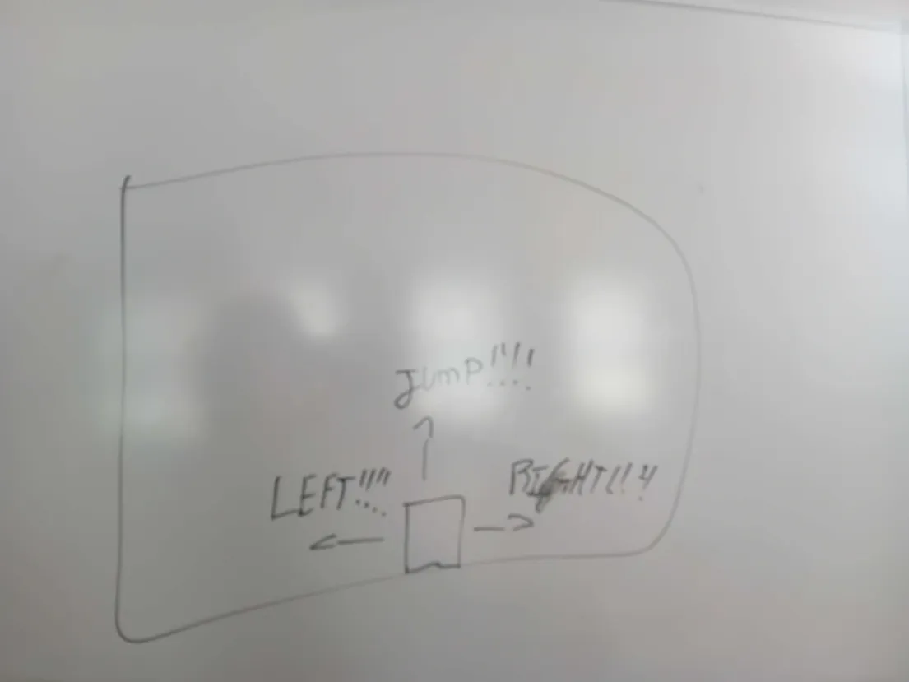

# Analysis

## The Problem

-   People don't fully realise the potential of audio based games, and games aren't accessible to people with motion issues.
  
## Stakeholders

-   People with motion issues (Either medical or simply due to age) who still want to play games, or anyone wants to try a different way of playing.

## Research

<!-- Only research done was for the machine learning part -->

<!-- Link to the ML website -->

## Features

-   Player with AABB collisions and blocks to collide with
-   Audio controls; will be implemented after player and blocks are
-   Player bounce

# Design

## Structure

Project will be made in Javascript, using a tiny sprinkle of HTML and CSS for rendering to the browser. For audio controlling, we have decided to opt for [Google's Teachable Machine](https://teachablemachine.withgoogle.com/), which we will throw into the frontend.

## User interface

## Decomposition

The program needs:
A section to take in the audio, then convert it to a "move" using teachable machine
A section to process where the character will now be / its velocity
A section to graphically output this information

Functions would include left(), right(), jump() and down() (The original plan didn't actually have down do anything, but with more time some functionality may have been implemented).
All 4 of those functions would be directly triggered by the teachable machine code. These functions would apply a velocity (or more likely just straight up move the character since velocity takes a while to implemented).

## Algorithms

...

## Test data

...

# Development

Procedural coding most likely

# Evaluation

...
